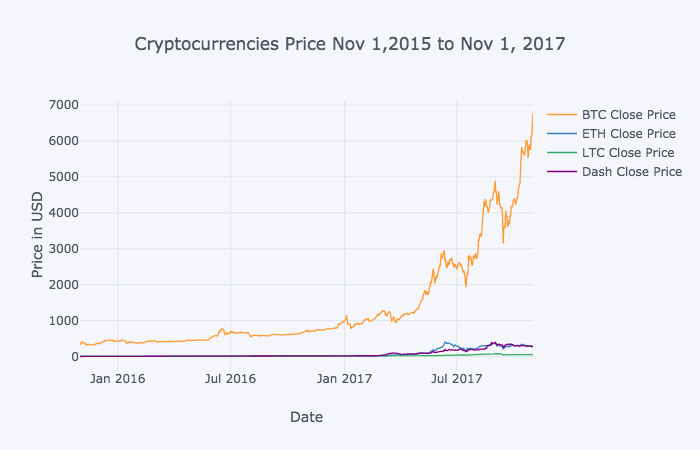
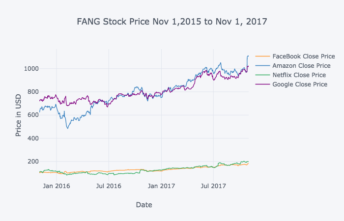
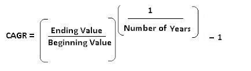
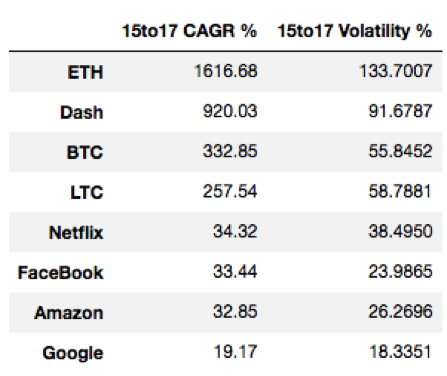
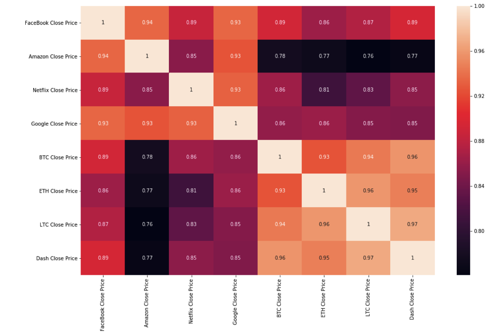

# 4 Major Cryptoassets Performances Compared to FANG Stocks

The purpose behind this project was to compare the returns and volatility of 4 major crypoassets (Bitcoin, Ethereum, Litecoin, and Dash) with high performing technology stocks (Facebook, Amazon, Netflix, and Google).

I gathered the crypoassets data from CoinMarketCap website. The data shows the close price (the price at 23:59:59 of each day) of each asset. 

I extracted the FANG stock data from Google Finance. This data shows the close price of each data at the end of a regular trading session.

To compare these two datasets I chose an arbitrary date range from November 1, 2015 to November 1, 2017. The reason I didn't go further back is because the public launch of ETH was on August 8,2015 and I extracted the data on November 13, 2017 so this date range seemed fair enough.

Let’s compare the two datasets:

 

By looking at these 2 graphs we can tell that Bitcoin (BTC) has had a huge growth during this period. But let’s look at the numbers to make sure that we are right.

We can compare investments of different types with one another, by calculating the compound annual growth rate (CAGR), which measures the average rate of an investment’s growth over a variable period of time.

To calculate compound annual growth rate, we need to divide the value of an investment at the end of the period by its value at the beginning of that period, raise the result to the power of one divided by the period length, and subtract one from the subsequent result:

While returns are often the topic of trending conversations, if unaccompanied by an investigation of volatility, investors may be undercompensated for the risk they're taking.

The volatility can be calculated by getting the standard deviation of the daily price change over a given period of time.

To present this volatility in annualized terms, we simply need to multiply our daily standard deviation by the square root of trading days in a given year. 

Note that for stocks there are 252 trading days per year whereas crypoassets trading happens everyday all day, so there are 365 trading days.

Below is the CAGR and Volatility percentage for digital assets and FANG stocks:

 

Comparing the performance of the FANG stocks with our selected crypoassets reveals interesting insights:

•	Although the FANG names have provided high annual returns, yet compared with digital assets these investments pale.

•	LTC's CAGR%, the lowest CAGR% among other crypoassets, is 7.5 times more than Netflix's CAGR%, the highest CAGR% among other FANG stocks.

To make it more clear, a $100 investment in Netflix on Nov1, 2015 would retain $180 after 2 years, whereas the same investment on LTC would retain about $1280.

•	The first graph might have misled us to think that Bitcoin has had the highest return, but Ethereum's CAGR% is almost 5 times BTC's CAGR%.

In other words, a $100 investment in BTC on Nov 1, 2015 would retain $1873 after 2 years, whereas the same investment on ETH would retain about $29,470!

But as mentioned before, the levels of risk associated with returns are also important:

 

Above table shows that both CAGR and volatility percentage of crypoassets are higher than the FANG stocks.

Calculating the correlation between CAGRs and volatilities also reveals a strong positive relationship between the two. This clearly indicates "the bigger the risk the bigger the reward". 

Speaking of correlations, the correlation between these 2 groups worth investigating:
 

Above correlation heat map shows that:

- All of them are highly and positively correlated (> 0.7).

- Among FANG stocks Facebook and amazon have the highest correlation (0.93).

- Among crypoassets Dash and Litecoin have the highest correlation (0.97)

- Amazon is less correlated to cryptoassets than the other FANG stocks.
